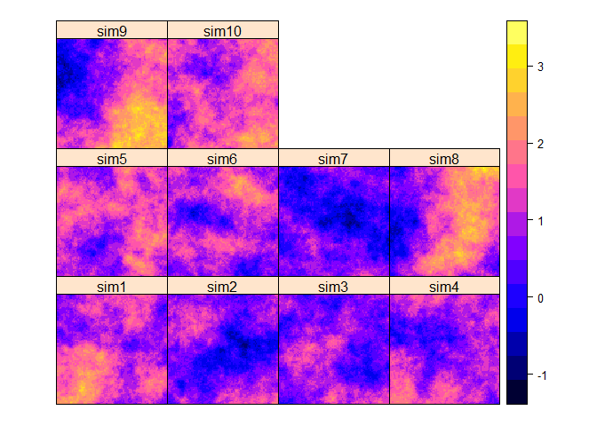

# HW#4 Qestion #1
Blake C. Kronkosky, P.E.  
Saturday, September 26, 2016  

This is an R Markdown document GEOG 5330 HW #4. 
The libraries used for this assignment where:

```r
#libraries used-------
wd <- 'D:/GEOG5330/R/week4-bckronkosky'
setwd(wd)
library(gstat)
```

```
## Warning: package 'gstat' was built under R version 3.1.3
```

```r
library(raster)
```

```
## Warning: package 'raster' was built under R version 3.1.3
```

```
## Loading required package: sp
```

```
## Warning: package 'sp' was built under R version 3.1.3
```

```r
#--------------------
```

A function was create to output a krigging map from simulted data.
The function is provided below:


```r
function.krig <- function
(
model,
psill,
range,
nugget
)
{
xy        <- expand.grid(1:100, 1:100)
names(xy) <- c('x','y')
g.dummy <- gstat(formula=z~1, 
                 locations=~x+y, 
                 dummy=T, 
                 beta=1, 
                 model=vgm(psill=psill, range=range,nugget=nugget, model=model),
                 nmax=10
                 ) 
yy <- predict(g.dummy, newdata=xy, nsim=10)
coordinates(yy)=~x+y
gridded(yy) =T

return(spplot(yy))
}
```

This is part 1.1 
sill= 0.5, range = 5, nugget = 0.0001, model = Exponential 


```r
function.krig(model ='Exp',psill = .5,range =5,nugget = 0.0001)
```

```
## [using unconditional Gaussian simulation]
```

<!-- -->

This is part 1.2 
sill= 0.5, range = 5, nugget = 0.0001, model = Gaussian 


```r
function.krig(model ='Gau',psill = .5,range =5,nugget = 0.0001)
```

```
## [using unconditional Gaussian simulation]
```

<!-- -->


This is part 1.3
sill= 0.5, range = 50, nugget = 0.0001, model = Exponential  


```r
function.krig(model ='Exp',psill = .5,range =50,nugget = 0.0001)
```

```
## [using unconditional Gaussian simulation]
```

<!-- -->

Provided is a general summary of the differences:
1.1	versus 1.2)

The size of the clusters appear to be different mainly from how the Gaussian and exponential variograms react to the parameters.  The concave up nature of the exponential function allows the variance to grow quicker; resulting in smaller clusters sizes.  The Gaussian curve has an s-curve shape which causes the variance versus distance to grow less rapidly compared to the exponential; hence the larger cluster sizes.

1.1	vesus 1.3) 

As the range increases with the variogram model; values further away are introduced to the spatial model.  This can be seen the large scale clustering patterns in figure 1.3.


