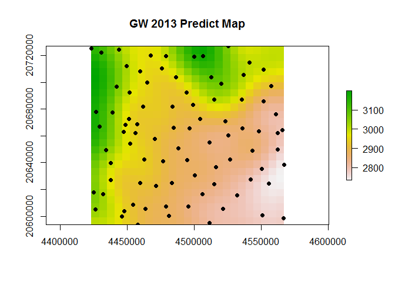
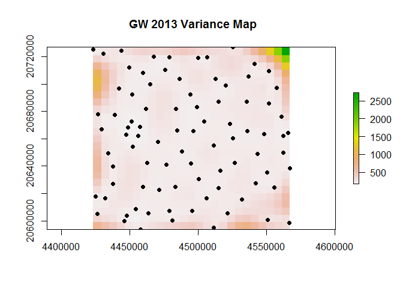

# HW#4 Qestion #2
Blake C. Kronkosky, P.E.  
Saturday, September 26, 2016  

This is an R Markdown document GEOG 5330 HW #4 Part 2. 
The libraries used for this assignment where:

```r
#libraries used-------
wd <- 'D:/GEOG5330/R/week4-bckronkosky'
setwd(wd)
library(gstat)
```

```
## Warning: package 'gstat' was built under R version 3.1.3
```

```r
library(raster)
```

```
## Warning: package 'raster' was built under R version 3.1.3
```

```
## Loading required package: sp
```

```
## Warning: package 'sp' was built under R version 3.1.3
```

```r
library(maptools)
```

```
## Warning: package 'maptools' was built under R version 3.1.3
```

```
## Checking rgeos availability: TRUE
```

```r
library(sp)
library(rgdal)
```

```
## Warning: package 'rgdal' was built under R version 3.1.3
```

```
## rgdal: version: 1.1-8, (SVN revision 616)
##  Geospatial Data Abstraction Library extensions to R successfully loaded
##  Loaded GDAL runtime: GDAL 2.0.1, released 2015/09/15
##  Path to GDAL shared files: C:/Users/BKronkosky/Documents/R/win-library/3.1/rgdal/gdal
##  GDAL does not use iconv for recoding strings.
##  Loaded PROJ.4 runtime: Rel. 4.9.1, 04 March 2015, [PJ_VERSION: 491]
##  Path to PROJ.4 shared files: C:/Users/BKronkosky/Documents/R/win-library/3.1/rgdal/proj
##  Linking to sp version: 1.2-3
```

```r
library(automap)
```

```
## Warning: package 'automap' was built under R version 3.1.3
```

```r
#--------------------
```

This is the bulk of the script used to interpolate groundwater data for 2013.  It should be noted a Gaussian model was used, but the data indicates continues growing variance versus distance (linear).  Possibly another spatial model could be used in place of ordinary kriging; maybe local.


```r
gwshape             <- readOGR(dsn = wd,layer = 'oa')
```

```
## OGR data source with driver: ESRI Shapefile 
## Source: "D:/GEOG5330/R/week4-bckronkosky", layer: "oa"
## with 132 features
## It has 76 fields
```

```r
gwdata              <- data.frame(gwshape@coords,gwshape$WTE2013)
colnames(gwdata)    <- c('x','y','WTE2013')
gwdata              <- gwdata[gwdata[,3]!=0,]
coordinates(gwdata) <- ~x+y
gwdata@proj4string  <- crs(gwshape)


gwvg <- variogram(WTE2013~1,gwdata)

gwvg.fit <- fit.variogram(gwvg,model=vgm(psill = 8552,
                                         range = 65776,
                                         nugget = 0,
                                         model = 'Gau'
                                         )
                          )

gwgrid <-
SpatialPoints(raster(extent(gwdata),nrows = 25,ncol = 25,crs = crs(gwdata)),
              proj4string = crs(gwdata)
             )

gwkrig               <- krige(WTE2013~1,gwdata,gwgrid,model=gwvg.fit)
```

```
## [using ordinary kriging]
```

```r
predict              <- data.frame(gwkrig$var1.pred,gwkrig@coords)
coordinates(predict) <- ~x+y
gridded(predict)=T


var                  <- data.frame(gwkrig$var1.var,gwkrig@coords)
coordinates(var)     <- ~x+y
gridded(var)=T
```

This is the plot for 2.1; Predicted Groundwater WSEL at 25x25 grid


```r
plot(raster(predict), main="GW 2013 Predict Map")
points(gwdata, pch=16)
```

<!-- -->

This is plot for 2.2; Variance Groundwater WSEL at 25x25 grid


```r
plot(raster(var), main=" GW 2013 Variance Map")
points(gwdata, pch=16)
```

<!-- -->

The variance appears to be fairly consistent across the grid; mainly from ~ constant spacing of the sampling locations.
  
Provided below is the result for the CV for model to part 2.3


```r
cv <- krige.cv(WTE2013~1,gwdata,gwgrid, model=gwvg.fit,nfold=nrow(gwdata)) 
sqrt(sum(cv$residual^2))
```

```
## [1] 280.4131
```

